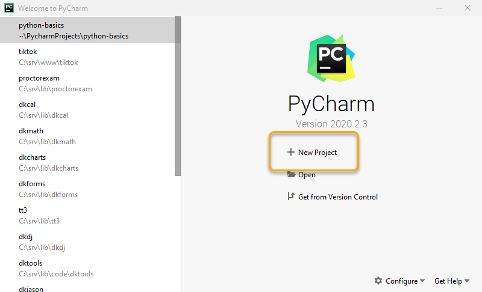
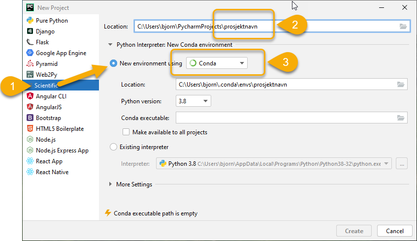
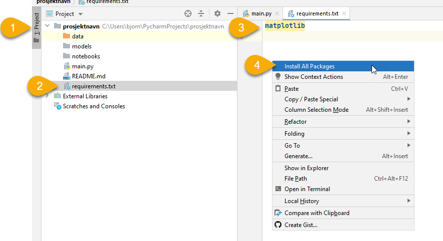
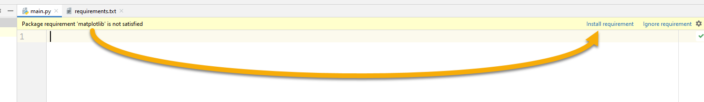
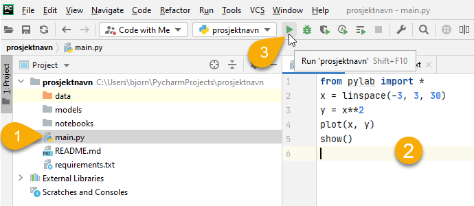

# du trenger..

- Anaconda: https://www.anaconda.com/products/individual
- PyCharm Professional Edition (kan lastes ned som siste steg i
  Anaconda installasjonen eller fra https://www.jetbrains.com/pycharm/)

# "workspace"

1. Start PyCharm og velg "New Project"
   
1. Velg Scientific, oppgi et nytt prosjektnavn, bruk Conda
   
1. Åpne `requirements.txt` filen og skriv inn `matplotlib`, ~~deretter 
   høyreklikk i `requirements.txt` fila og velg "Install All Packages"~~
   

   a. du ser hvor langt installasjonen har kommet nederst i vinduet:

      

   b. vent til PyCharm er ferdig å installere:

      

1. Åpne `main.py` fila og lim inn 
    ```
    from pylab import *
    x = linspace(-3, 3, 30)
    y = x**2
    plot(x, y)
    show()
    ```
1. Installer manglende requirements:

   

1. Kjør programmet

   

1. Du skal nå se en graf.
